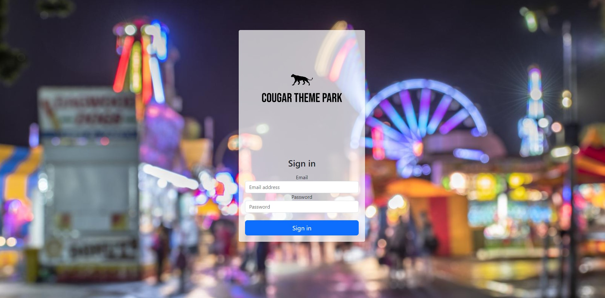

# Cougar Theme Park<hr>

## Them Park Management System Web Application



The Theme Park Management System is a web application designed to manage information about a specific theme park and collect data to provide various reports on park operations, visitor statistics, ride maintenance, and more. It offers user authentication with different user roles and provides the following features:
<hr>

## Key Features
The Theme Park Management System offers a comprehensive set of features to efficiently manage and analyze theme park operations. These features include:

##### User Authentication:
Different user roles, including administrators and staff members, with varying levels of access and permissions.

#### Data Entry Forms:
- **Data Creation:** Easily add new data entries for rides, visitors, events, and maintenance.
- **Data Modification:** Modify existing data as necessary to keep records up to date.
- **Data Simulation:** Simulate data deletion as part of the system for testing and management purposes.

#### Triggers:
**Automated Actions:** Implement at least two triggers to automate specific actions or processes within the system. Triggers can be used for tasks like sending notifications or generating reports.

#### Data Queries:
**Data Retrieval:** Create and execute at least three data queries to extract and analyze information from the database. These queries can assist in generating reports and retrieving specific statistics.

#### Data Reports:
The system is capable of generating a variety of data reports to provide valuable insights into different aspects of theme park operations. Some of the report types include:

- **Customer Statistics:** Track the number of customers and calculate the average number per month.
- **Maintenance Analysis:** Determine the average number of rides needing maintenance.
- **Ride Popularity:** Identify the most frequently ridden rides per month.
- **Weather Data:** Record the number of rainouts per month and determine which month had the most.
- **Attendance Trends:** Analyze spikes in the average number of customers on a weekly and monthly basis.
<hr>

## Technologies & Libraries Used
The Theme Park Management System is built using a combination of technologies and libraries to achieve its functionality and performance. Here is an overview of the key components used in this project:

#### Frontend:
- **HTML:** Used for creating the structure of web pages.
- **CSS:** Utilized for styling the web interface and enhancing user experience.
- **JavaScript:** Used for client-side scripting to add interactivity.
#### Backend:
- **Node.js:** The runtime environment for server-side code execution.
- **Express.js:** A web application framework for building RESTful APIs and handling routes and requests.
#### Client-Side Script Loading:
- **Require.js:** A JavaScript file and module loader used to optimize and structure code.
#### Database:
- **Microsoft SQL:** The database system hosted on Azure, where critical data is stored and managed.
#### Node.js Libraries:
List any specific Node.js libraries you've used for different purposes, such as authentication, data access, or other functionalities.
<hr>

## Getting Started

#### Prerequisites
Before you can run this web app, make sure you have the following software installed on your machine:

`Node.js` - The web app framework used for this project.

#### Intallation
Clone repository into your local machine:
```
$ git clone https://github.com/RomanGuerra/CougarThemePark.git
```
Change into project directory:
```
$ cd CougarThemePark
```
Install dependencies:
```
$ npm install
```

#### Usage
To run the Theme Park Management System web app, use the following command:
```
$ node WEBAPP.js
```
This will start the local server, and you can access the app by opening your web browser and navigating to `http://localhost:5500`
<hr>

## Contact
If you have any questions or need further assistance, feel free to contact any team member:

Sana Azhar
GitHub: [Sanaazhar59](https://github.com/Sanaazhar59)

Roman Guerra
GitHub: [RomanGuerra](https://github.com/RomanGuerra)

Nathan Cao
GitHub: [nntcao](https://github.com/nntcao)

Godswill Effi
GitHub: [gceffi](https://github.com/gceffi)

Angelos Mintzaridis
GitHub: [AngelosM2002](https://github.com/AngelosM2002)